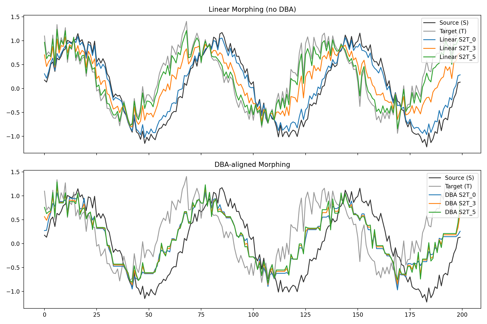

# tsMorph

tsMorph is a Python package designed to generate semi-synthetic time series through morphing techniques. It enables the systematic transformation between two given time series, facilitating robust performance evaluation of forecasting models.

This package is based on the paper:  
**Santos, M., de Carvalho, A., & Soares, C. (2024).** *Enhancing Algorithm Performance Understanding through tsMorph: Generating Semi-Synthetic Time Series for Robust Forecasting Evaluation.* [arXiv:2312.01344](https://arxiv.org/abs/2312.01344)

## Features
- **Generation of Semi-Synthetic Time Series**: Creates a set of intermediate time series transitioning from a source series (S) to a target series (T).
- **Performance Understanding**: Evaluates forecasting models' robustness using MASE (Mean Absolute Scaled Error) over synthetic series.
- **Feature Extraction**: Uses `pycatch22` to extract time series features for deeper analysis.
- **Visualization Tools**: Provides plotting functions to explore synthetic time series and their performance.

## Installation

```bash
pip install tsmorph
```

## Usage

### Generate Semi-Synthetic Time Series

```python
import numpy as np
import pandas as pd
from tsmorph import TSmorph

# Define source and target time series
S = np.array([1, 2, 3, 4, 5])
T = np.array([6, 7, 8, 9, 10])

ts_morph = TSmorph(S, T, granularity=5)
synthetic_df = ts_morph.fit()
print(synthetic_df)
```

### Plot Semi-Synthetic Time Series

```python
ts_morph.plot(synthetic_df)
```

### Performance Understanding with Forecasting Models

```python
from some_forecasting_model import TrainedModel

# Assume a trained forecasting model compatible with NeuralForecast
model = TrainedModel()

# Define forecast horizon
horizon = 2

# Analyze performance over synthetic series
ts_morph.analyze_morph_performance(synthetic_df, model, horizon)
```

## Citation
If you use `tsMorph` in your research, please cite:

```bibtex
@article{santos2024tsmorph,
  title={Enhancing Algorithm Performance Understanding through tsMorph: Generating Semi-Synthetic Time Series for Robust Forecasting Evaluation},
  author={Santos, Mois{\'e}s and de Carvalho, Andr{\'e} and Soares, Carlos},
  journal={arXiv preprint arXiv:2312.01344},
  year={2024}
}
```

## Exemplo: Comparação visual — Linear vs DBA 🔧

Este repositório inclui um exemplo que gera uma comparação visual entre o morphing linear (puro) e o morphing com alinhamento via DBA.

- Arquivo de exemplo: `examples/compare_morphing.py`
- Gera: `examples/morph_comparison.png`

Como executar:

```bash
python examples/compare_morphing.py
```

O script gera um gráfico com duas linhas de subplots:
- Topo: morphing linear entre `S` e `T` (sem alinhamento temporal).
- Fundo: morphing com DBA (as séries são alinhadas antes da interpolação).

Ele também imprime um tempo simples de benchmark (tempo de execução do `fit` com e sem DBA). Tipicamente, observamos que o DBA é mais lento devido ao cálculo do caminho DTW iterado.

Exemplo de saída (imagem gerada):



---

## License
This project is licensed under the GNU General Public License v3.0.
